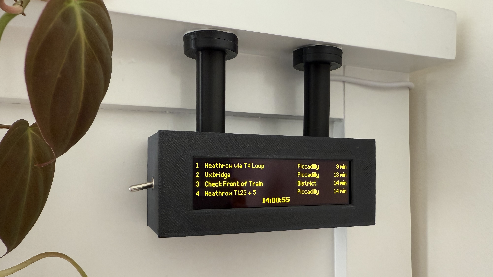
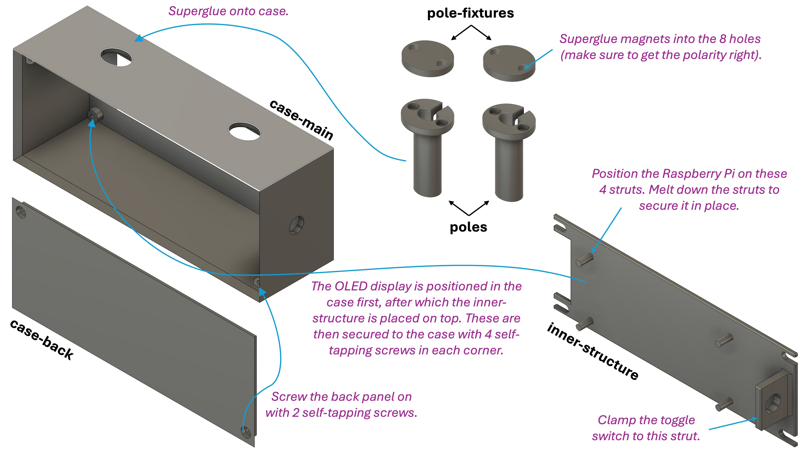

# 🚇 Tube Departure Board for Raspberry Pi



Recreate the iconic London Underground departure board with a Raspberry Pi! This Python-based application fetches live train data from the Transport for London (TfL) Unified API and displays it in real-time on a compact OLED screen, designed to mimic the classic dot-matrix look. 

### Table of Contents

**[✨ Features](#-features) <br> 
[📋 Prerequisites](#-prerequisites) <br>
[🔌 Raspberry Pi Setup](#-raspberry-pi-setup) <br>
[🔧 Hardware Assembly and Wiring](#-hardware-assembly-and-wiring) <br>
[💻 Software Installation](#-software-installation) <br>
[🙏 Credits & Inspiration](#-credits--inspiration)**

<br>

## ✨ Features

- **Live London Underground Data:** Fetches real-time Tube arrival predictions for configurable stations and lines.

- **Dot-Matrix Aesthetics:** Utilises a [Dot Matrix Typeface](https://github.com/DanielHartUK/Dot-Matrix-Typeface) to give your display an authentic departure board feel.

- **Compact Display:** Designed for an SSD1322 OLED display on Raspberry Pi.

- **Dual Line Toggle:** Switch between two sets of Tube lines/directions using a physical toggle switch.

- **Smart Power Management:** Includes Raspberry Pi temperature monitoring to prevent overheating.

- **Multi-threaded Architecture:** Uses separate threads for API fetching and display rendering to ensure smooth, responsive updates.

- **Custom 3D-Printed Case:** Design files provided for a miniature Tube departure board enclosure.

## 📋 Prerequisites

To build your London Underground Departure Board, you'll need the following:

- **Raspberry Pi:** Any model capable of running Raspberry Pi OS. I personally used a [Pi Zero WH](https://thepihut.com/products/raspberry-pi-zero-wh-with-pre-soldered-header?variant=547332849681&country=GB&currency=GBP&utm_medium=product_sync&utm_source=google&utm_content=sag_organic&utm_campaign=sag_organic&gad_source=1&gad_campaignid=11284298573&gbraid=0AAAAADfQ4GGELxyUDK-MXwh7vph4BEDCa&gclid=Cj0KCQjw1JjDBhDjARIsABlM2SsFhuRp0j_vZ-WN3Cg39v57Ki52kaFcM2Zpd7_jJAu70MgbLrW5hQMaAmodEALw_wcB).

- **Micro SD card:** For installing the Raspberry Pi OS.

- **Internet Connection:** For the Raspberry Pi to access the TfL API.

- **OLED Display:** An [SSD1322-based OLED display module](https://www.ebay.co.uk/itm/265720175865) connected via SPI.

- **Toggle Switch (Optional but Recommended):** A [mini toggle switch](https://www.amazon.co.uk/dp/B077D9FRGL?ref=ppx_pop_mob_ap_share) connected to a GPIO pin on your Raspberry Pi to switch between the two line configurations (e.g. westbound and eastbound).

- **Transport for London (TfL) API Key:** Tube arrival data is fetched from the [Transport for London Unified API](https://api.tfl.gov.uk/).

- **Access to a 3D printer:** STL files for the custom case, designed to resemble a miniature tube departure board, are provided within this repository.

- **8x [5mmx2mm magnets](https://www.amazon.co.uk/dp/B09H2W3TQZ?ref=ppx_pop_mob_ap_share):** For mounting the miniature departure board.

- **4x M2.6x8mm self tapping screws:** To secure the display and Raspberry Pi to the case.

- **2 x M2.6x6mm self tapping screws:** For closing the case with the back cover.

- **Superglue:** For assembling some of the 3D-printed parts and securing the magnets.

- **Wires and soldering equipment:** For connecting the display and switch to your Raspberry Pi.

## 🔌 Raspberry Pi Setup

These steps prepare your Raspberry Pi's operating system for the project.

### 1. Flash Raspberry Pi OS

- Download the [Raspberry Pi Imager](https://www.raspberrypi.com/software/) for your computer
- Use the Imager to flash Raspberry Pi OS onto your Micro SD card with the following OS customisation settings:
  - **Enable SSH** with password authentication (under the 'Services' tab). This is essential for connecting to your Pi remotely.
  - **Set a username and password.** Make a note of these; you'll need them for SSH access.
  - **Configure wireless LAN.** Add your SSID (Wi-Fi network name) and password.
  - **Set up the locale settings** with the `Europe/London` timezone.
- Insert the prepared SD card into your Raspberry Pi.

### 2. Connect to your Raspberry Pi

- The Raspberry Pi receives its power through its Micro USB Power port. Connect a standard 5V power supply to this port. *Note: On the Pi Zero WH, this is typically the port closest to the end of the board, distinct from any data-only USB ports.*

- Find your Pi's IP address (e.g., from your router's connected devices list) and connect via SSH from your computer:

    ```
    ssh <your_username>@<your_pi_ip_address>
    # Use the username and password you set in the Imager.
    ```

### 3. Enable SPI interface:

For your SSD1322 OLED, you'll need to enable the SPI interface on your Raspberry Pi.

- Open the Raspberry Pi Configuration tool:

    ```
    sudo raspi-config
    ```
- Navigate to `Interface Options` -> `SPI` -> `Yes` to enable it.

- Select `Finish` and reboot your Pi if prompted.

## 🔧 Hardware Assembly and Wiring

This section guides you through preparing the 3D-printed case and connecting your components.

### **1. Wiring:**

The SSD1322 OLED display is wired to the Raspberry Pi by following the comprehensive instructions found in [Chris Crocker-White's UK national rail departure display](https://github.com/chrisys/train-departure-display/blob/main/docs/02-connecting-the-display-to-the-pi.md).

Additionally, a toggle switch has been integrated into this project. This switch enables the display to cycle between different sets of arrival information (for example, distinguishing between eastbound and westbound trains, or various platforms). It is set up in a pull-down configuration, as shown in the provided diagram:

- Connect the centre terminal of the switch to a 3.3V power pin on the Raspberry Pi (e.g., physical pin 17).

- Connect one of the outer terminals of the switch to a Raspberry Pi GPIO pin (e.g. GPIO17, physical pin 11).

- Connect a ~10k Ohm resistor between the Raspberry Pi GPIO pin and a ground pin on the Raspberry Pi. This resistor acts as a pull-down, ensuring the GPIO pin is held low when the switch is open.

      +--------------- (Raspberry Pi 3.3V Power Pin)
      |
      |
      |   +--------------------+
      |   |                    |
      |   |      (Switch)      |
      |   |                    |
      |   +--------------------+
      |             |          |
      |        (Centre Pin) (Outer Pin)
      |             |          |
      +-------------+          |
                               |
                               +------------ Raspberry Pi GPIO Pin
                               |
                               |
                        [ 10kΩ Resistor ]
                               |
                               |
                               | 
                   Raspberry Pi Ground Pin

### **2. 3D Print the Case:**

3D print the [STL files](3D_print_files) provided in this repository. I printed the parts using black PLA filament on an Ender 3 printer.

To give a quick overview, the 3D-printed case consists of the following parts, designed to assemble into a compact and functional departure board:



- **Case-main:** The primary rectangular enclosure featuring a cutout at the front for securely fitting the OLED display. Its open rear is designed to be covered by the `case-back` panel.

- **Case-back:** A flat panel that forms the rear closure of the `case-main`, attaching securely with self-tapping screws.

- **Pole (x2):** Two hollow, elliptical posts designed to be superglued to the top of the `case-main`. They align with an elliptical opening on the `case-main`'s top surface, allowing the Raspberry Pi's Micro USB power cable to pass through them. The top of each pole is designed to house two 5mm diameter magnets for mounting the assembled board.

- **Pole-fixture (x2):** Two flat, elliptical parts that are intended to be permanently glued/taped to the desired mounting surface (designed for an overhang). Each `pole-fixture` is designed to hold two 5mm diameter magnets, enabling the departure board's poles to magnetically attach and detach.

- **Internal-structure:** This component fits inside the `case-main`. It features four integrated mounting posts that align with the Raspberry Pi's screw holes, allowing the Pi to be mounted to it. The Pi is secured by heat-staking the posts (gently melting them with a soldering iron), a technique inspired by [Chris Crocker-White's design](https://github.com/chrisys/train-departure-display/blob/main/docs/03-assembling-the-case.md). The `internal-structure` then sits on top of the OLED display, and both are secured into the `case-main` using four self-tapping screws at each corner. It also incorporates a rectangular strut designed for clamping the toggle switch.

### 3. Assemble everything!


***Important Pre-Assembly Note:** After securing the switch to the `internal-structure` and placing the Raspberry Pi, it becomes difficult or impossible to insert the Micro SD card. Therefore, ensure you complete the "Flash Raspberry Pi OS" step (Step 1 in the Raspberry Pi Setup section) and insert the prepared SD card into your Raspberry Pi before proceeding with the full assembly steps below.*

Follow these steps to assemble your departure board:

- **Prepare magnets & poles:**
Superglue the 5mm diameter magnets into the designated holes in both the `pole` and `pole-fixture` parts. Ensure you get the polarity right so that the poles on the departure board attract, rather than repel, the magnets in the fixture!
Superglue the `poles` onto the top surface of the `case-main`, aligning them with the elliptical openings.

- **Mount Raspberry Pi & switch:**
Position the Raspberry Pi on the four struts of the `internal-structure` and secure it in place by heat-staking the struts (gently melting them with a soldering iron to secure the Pi's mounting holes). Clamp the toggle switch onto the rectangular strut of the `internal-structure` using the bolt that usually comes with the toggle switch.

- **Position display:**
Carefully position the display over the front opening of the `case-main`.

- **Assemble case with electronics:**
Place the `internal-structure`(with the Raspberry Pi and toggle switch now attached) into the `case-main`, resting it on top of the display. Secure both the display and `internal-structure` to the `case-main` using 4x M2.6x8mm self-tapping screws, one in each corner.

- **Connect Micro USB power:**
Connect the Micro USB cable to your Raspberry Pi's power port, carefully threading it through the hollow pole that aligns with the power port.

- **Final enclosure:**
Arrange all wires neatly inside the case.
Secure the back panel (`case-back`) to the `case-main` with 2x M2.6x6mm self-tapping screws.

## 💻 Software Installation

These steps cover obtaining the project code, installing software dependencies, and configuring the application.

### 1. Clone the GitHub repository:

- From your Raspberry Pi's terminal, navigate to where you want to store the project (e.g., your home directory `cd ~`) and clone the repository:

    ```
    cd ~
    git clone https://github.com/isi22/Tube-Departure-Board
    cd Tube-Departure-Board
    ```

### 2. Create a python virtual environment:
Using a virtual environment is best practice for managing project dependencies.

```
python3 -m venv .venv
source .venv/bin/activate
```

### 3. Install system and python dependencies:
Install system dependencies (for fonts and display drivers and all required Python packages from the `requirements.txt`.

```
sudo apt-get install -y python3-dev libjpeg-dev zlib1g-dev libfreetype6-dev liblcms2-dev libopenjp2-7 build-essential pkg-config

pip install -r requirements.txt
```

### 4. Configure the project settings:

Update the `config.py` file with your project-specific configurations. This is where you define your station, the lines to monitor, and settings for your OLED and optional GPIO switch.

- Open the file:
    ```
    nano src/config.py
    ```

- Once `nano` opens, you will see the contents of `config.py`. Use the arrow keys to move the cursor up, down, left, and right. Type directly to make your changes.

- Save and Exit (`Ctrl + X`).

### 5. Set up the main script as a systemd service:

To ensure the departure board starts automatically when your Raspberry Pi boots and runs reliably in the background, set it up as a systemd service.

- Create a systemd service file:
    ```
    sudo nano /etc/systemd/system/tube-departure-board.service
    ```

- Add the following content to the file. Replace `<your_username>` and `<your_api_key>` with your actual username and API credentials. The TfL API Key (referred to as primary key) can be found in your [Profile](https://api-portal.tfl.gov.uk/profile) in the TfL API portal after registering and subscribing to the `500 Requests per min` product.

    ```
    [Unit]
    Description=London Underground Departure Board Service
    After=network.target

    [Service]
    User=<your_username>
    WorkingDirectory=/home/<your_username>/Tube-Departure-Board
    ExecStart=/home/<your_username>/Tube-Departure-Board/.venv/bin/python /home/<your_username>/Tube-Departure-Board/src/main.py
    Restart=on-failure
    StandardOutput=journal
    StandardError=journal
    Environment = "TFL_API_KEY=<your_api_key>"
    
    [Install]
    WantedBy=multi-user.target
    ```

- Save and exit (Ctrl+O, Enter, Ctrl+X in nano).

- Reload systemd, enable, and start the service:

    ```
    sudo systemctl daemon-reload
    sudo systemctl enable tube-departure-board.service
    sudo systemctl start tube-departure-board.service
    ```

- Check the service status and logs:

    ```
    sudo systemctl status tube-departure-board.service
    journalctl -u tube-departure-board.service -f # For live service logs
    ```

- Confirm that the service is active (running).

## 🙏 Credits & Inspiration

This project draws inspiration and direct resources from the following:

- **Dot Matrix Typeface:** The authentic visual style is achieved using [Daniel Hart's](https://github.com/DanielHartUK/Dot-Matrix-Typeface) excellent Dot Matrix Typeface.

- **Core Code & Logic:** Both [Chris Crocker-White's](https://github.com/chrisys/train-departure-display) UK National Rail Departure Display and [Sean Petykowski's](https://github.com/petykowski/London-TFL-Arrivals-Board) London TfL Arrivals Board served as direct inspiration and a foundational basis for the Python code and API interaction logic implemented in this project.

- **Hardware Design, Assembly & 3D Printed Parts:**
[Chris Crocker-White's](https://github.com/chrisys/train-departure-display) comprehensive documentation for his UK National Rail Departure Display was particularly instrumental for the hardware design, assembly techniques (such as heat-staking the Raspberry Pi into the case), and provided significant inspiration for the custom 3D-printed enclosure parts. His detailed wiring guide for the display was also followed.


